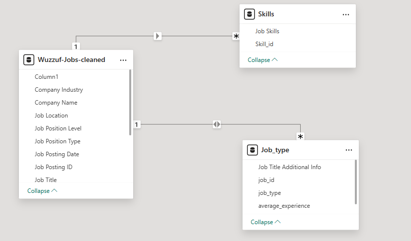

# 📊 Job Pulse Dashboard | Wuzzuf Egypt Jobs Analysis  
**Power BI Dashboard for Egyptian Job Market Insights**  

## 🔗 Useful Links

- 📌 [Live Dashboard Preview](https://app.powerbi.com/view?r=eyJrijoiMjI0NTRiYzYtMzY1YS00MTUzLTkyYZgtNGRINzRhMDA52DE3liwidCl6ijRlNDVkNic3LTq3NjctNDNkNy1iNzZmLTdhNzVlMzRkMjFKYiJ9)  
- 📹 [Video Demo](https://www.loom.com/share/52345eca004843dc9bd87599d2678b097sid=4f4131a2-b770-46ab-9ef7-cc2a871dd5cf) 
- 📄 [Full Project Report](Report_job_dashbord.pdf)

---

## 🔍 Project Overview  
This is an interactive Power BI dashboard analyzing **Wuzzuf job postings in Egypt**, designed to help:  
- **HR Professionals** identify hiring trends.  
- **Job Seekers** discover in-demand skills and top companies.  

### Key Features:  
- 5+ Dynamic Visualizations (Map, Bars, Pie, etc.)  
- Cross-Filtering & Real-Time Data Refresh  
- Cleaned and Optimized Dataset  

---

## 🚀 About Me & Skills

I am a data enthusiast passionate about turning raw data into actionable insights. In this project, I demonstrated my expertise in:  

- **Data Cleaning & Transformation:** Efficiently handled messy datasets using Power Query to prepare clean and reliable data.  
- **Data Modeling:** Designed optimized star schema models for better performance and usability in Power BI.  
- **DAX Mastery:** Created advanced DAX measures to unlock meaningful KPIs and insights.  
- **Visualization Design:** Built dynamic, user-friendly dashboards with interactive visuals to tell compelling data stories.  
- **Business Understanding:** Applied strong analytical skills to interpret job market trends and translate them into impactful reports.  

This project reflects my ability to manage end-to-end data projects and deliver valuable business intelligence solutions.

---

## 🧹 Data Cleaning Journey  

1. **Columns Handling**  
   - Removed irrelevant columns (e.g., inconsistent salary data).  
   - Replaced missing company names with "N/A".  

2. **Text & Categorical Data**  
   - Normalized job titles (fixed uppercase/lowercase).  
   - Split composite columns (Skills, JobType) into separate tables.  

3. **Advanced Transformations**  
   - Created Star Schema for optimized data modeling.  
   - Developed DAX measures for insightful metrics.  

---

## 📊 Dashboard Preview  

  

---

## 🗂️ Data Model Overview

---

## 📂 Files Included  
- PowerBI_Dashboard.pbix  
- Cleaned_Dataset.csv  
- README.md  
- Assets (folder with images)  

---

*Thank you for checking out the project!*

---

**Thank you for exploring the Job Pulse Dashboard — empowering Egypt’s workforce through data-driven insights for a brighter career future!**
